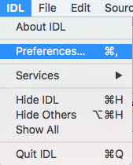
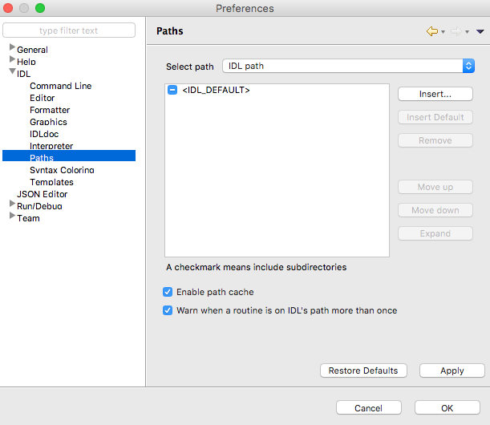
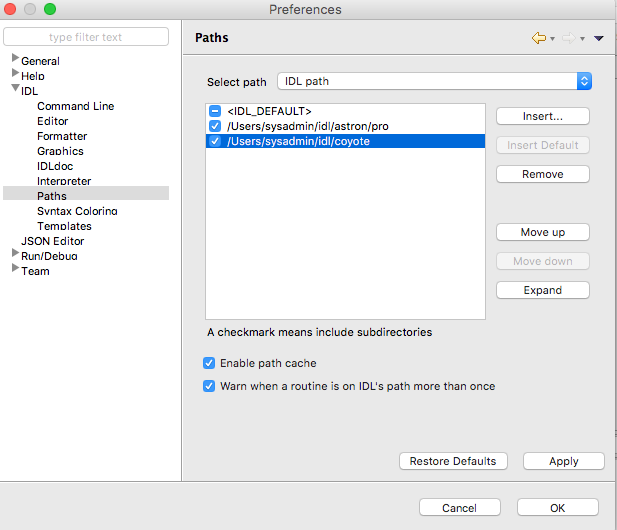
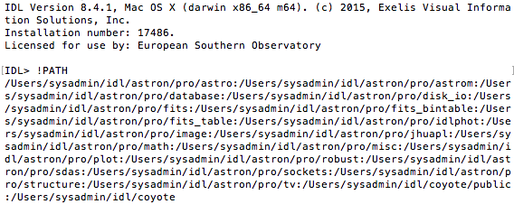
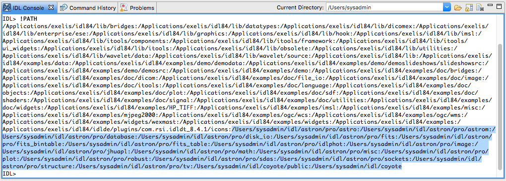
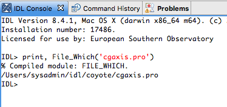
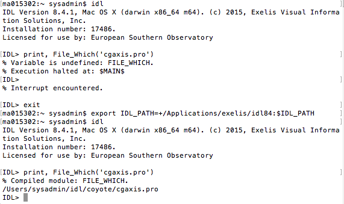

# Setting up IDL and adding libraries

The next information has been tested under OS X 10.11.6 using BASH and IDL 84 provided under the ESO repositories.

## IDL initial Setup

Depending on which shell should be used, EXELIS IDL 84 will provide the next scripts:

 * `/Applications/exelis/idl84/bin/idl_setup` to use with for C Shell
 * `/Applications/exelis/idl84/bin/idl_setup.bash` to use with Bash
 * `/Applications/exelis/idl84/bin/idl_setup.ksh` to use with Korn shell

Running one of the above scripts will let set up the correct path to run IDL from our shell.

In our example, we are assuming BASH and just adding the file to our `.profile` file will be enough to load automatically every time a shell or terminal is being used.

```
echo "source /Applications/exelis/idl84/bin/idl_setup.bash" >> ~/.profile
```

## Adding libraries

To add libraries to IDL like [Astronomy's user library](http://idlastro.gsfc.nasa.gov/) and [Coyote](http://www.idlcoyote.com/) the next steps are required:

 * Create a folder (to organize your library) like:
```
mkdir ~/idl/
```

 * Download and uzip the libraries
```
wget http://www.idlcoyote.com/programs/zip_files/coyoteprograms.zip
cd ~/idl/
unzip ../Downloads/coyoteprograms.zip
```

 * Export the libraries
```
echo "export IDL_PATH=+~/idl:$IDL_PATH" >> ~/.profile
```

Every new library will be added automatically, becuase the variable *`IDL_PATH`* is adding *`~/idl`* folder and all sibfolders.

To keep a better control or we need to specify different locations, use *`export`* has follow:

```
export IDL_PATH=/path/to/another/library:/another/path/:$IDL_PATH
```

The example above will include two folders _`/path/to/another/library`_ and _`/another/path/`_, and the current value from *`IDL_PATH`*.

## Adding libraries to Workbench
Adding libraries in the workbench is done easily with the next steps:

 1. Open the preferences dialog click on `IDL->Preferences` as display in the next image

 2. Choose expand `IDL` and choose `Paths`

 3. Click `Insert` button and choose the folder with the libraries. It is possible to add diferent locations. Remember to click in the `Apply` and `OK` buttons.


## Checking the paths added to IDL
If *IDL* is running in a Terminal of from a GUI, it is possible to verify which _PATH_ are visible, with a simple command:
```
!PATH
```
Notice the diference of folders from the Terminal and the GUI:
* Terminal output

* GUI output (user's library has been highlighted)


## Another quick test
Checking [this](http://www.idlcoyote.com/code_tips/installcoyote.php), and using the GUI, I run the next step.
* `print, File_Which('cgaxis')` 


It seems that the libraries are visible and working.

But, from the terminal it is necessary to add all the libraries already loaded in the GUI, because, as you will see in the next screenshot, the same command will failed:
.

The first time running `print, File_Which('cgaxis')`, we got a message *Variable is undefined: FILE_WHICH.*, to avoid that problem, the command `export IDL_PATH=+/Applications/exelis/idl84:$IDL_PATH` were added and running `IDL` again, was possible to fix this problem.

## External Links
This document has been prepared reading:
[Coyote](http://www.idlcoyote.com/)
[Coyote IDL Library Installation](http://www.idlcoyote.com/code_tips/installcoyote.php)
[Managing IDL Paths](http://www.harrisgeospatial.com/docs/Managing_IDL_Paths.html)

And the source of the document is in Markdown edited with [Haroopad](http://pad.haroopress.com/).
